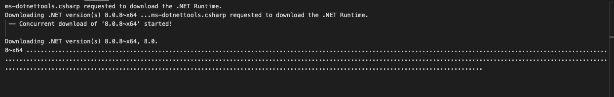

### 来个开题报告吧

	本人从事iOS开发数10年，一直钻研iOS各种控件如何高效使用，学习iOS的开发理念，进来闲暇之余，想学习一门跨平台的语言，用来适应当前社会需要的快速开发的现象。看了结果跨平台的语言，决定还是选择Flutter，理由如下：

	1、Flutter是由Google推出的语言，大平台，大公司，会持续更新。
	2、Flutter使用Dart语言实现，有AOT方式运行，效率会很高。
	3、Flutter的社区活跃度高，便于寻找自己需要的控件或者逻辑。

### 学习第一天：给自己的电脑配置Flutter

	1、先在Github上创建一个仓库，用来记录自己的学习过程、使用工具、学习资料、遇见的问题、特殊问题的解决方法。
	
	2、下载一个MaxDown软件用来编辑markdown文件，记录自己学习的日志。
	
	3、配置过程：
		
		1）、由于我用的是macbook Pro，Intel的芯片，原有的开发环境包括zsh、Xcode、cocoaPods都存在，且和官网要求一样，所以直接跳过这些配置。		
		
		2）、编译工具我采用Visual Studio Code。我电脑上原有的VS版本是1.77.3,版本够用，就不再升级了，直接安装Flutter extension for VS Code插件了。
		
		3）、上述工具已完成，都是之前存在的，因此花费时间较少。
		
		4）、配置Flutter的SDK，使用Visual Stadio Code工具，并参照官网文档一步一步执行的，但是在使用VS下载文档时一直下载失败，无奈之下选择手动下载，然后配置环境，同样参照官方文档。
		
		5)、经过不懈的努力，艰难的网络，终于下载完成，并按照教程完成配置，接下来开启自己的第一个应用吧。
		
	4、创建应用：
		
		1）、使用VS Code按照教程自动创建一个应用吧。
		2）、等待过程中有个东西下载需要不少时间，出去溜达溜达估计就好了，详情如下：
		
		
		
		
		
		
		
		
		
		
		
		
		
		
		
		
		
		
		
		